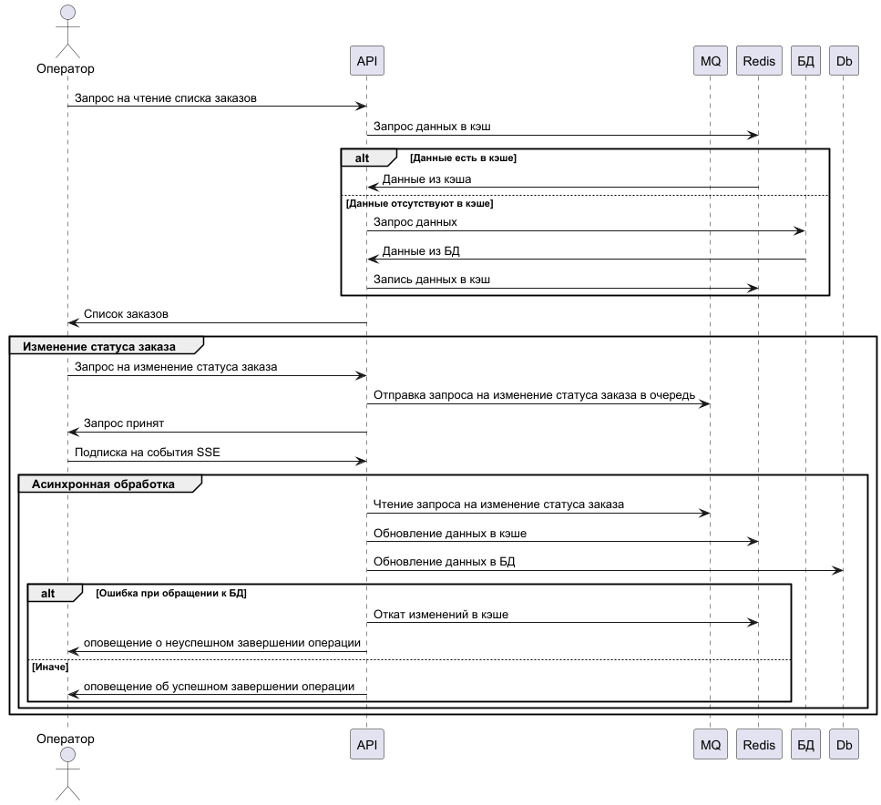

## Анализ диаграммы системы и её описания

На текущий момент в системе существует проблема долгого отображения списка заказов в интерфейсе MES. Из описания системы стоит 
отметить приоритетную потребность в отображении заказов в статусе ***MANUFACTURING_APPROVED*** (заказ подтверждён, его можно 
отдавать в производство). Внедрение системы кэширования позволит ускорить процесс отображения заказов и уменьшить нагрузку 
на систему.
Реализация серверного кэша для быстрой отдачи заказов в статусах, которые подразумевают обработку оператором MES, решит
проблему долгой загрузки заказов в интерфейсе MES.

##  Мотивация

Проблемы, которые будут решены после внедрения кеширования:
1. Уменьшение времени получения списка заказов операторами MES.
2. Уменьшение нагрузки на систему. Быстрый доступ к часто запрашиваемым данным позволяет ускорить время отклика системы.

Улучшения производительности и скорости загрузки списка заказов позитивно отразятся на пользовательском опыты операторов MES.

## Предлагаемое решение

Для кэширования информации по заказам будет использоваться серверное кэширование. В качестве системы кэширование предлагается 
использовать Redis. Redis отличается высокой производительностью, возможностью масштабирования. Серверное кеширование позволяет 
централизованно управлять данными, снижает нагрузку на серверы и уменьшает время отклика для всех пользователей.

Основная идея - хранить список заказов, над которыми могут вести работу операторы MES. Для этого необходимо обеспечить:
1. Предварительную загрузку заказов в кэш, готовых к обработке и находящихся в обработке
2. Актуальность основной информации по заказам в кэше

Выбран подход: ***Cache-Aside***. Он прост в реализации и хорошо подходит для часто читаемых и редко изменяемых данных.
Из минусов можно отметить возможную несогласованность данных в кеше с базой данных. Проблема решается ручной инвалидацией кэша.
В качестве стратегии инвалидации кэша выбрана ***инвалидация по ключу***. Данные в кеше обновляются только при изменении в 
бд. Это обеспечивает высокую точность данных, но потребует точности в реализации.
Подход ***Read-Through*** не выбран по причине чувствительность к ошибкам. Подход ***Refresh-ahead*** не выбран по причине сложности
реализации. Подходы ***Write-Through***, ***Write-Behind*** подходят при преобладании операций записи на операциями чтения.

## Диаграмма последовательности

## Разбор ситуации по результатам ревью

> Вопрос на подумать, что делать, если пользователь отменил запрос,например закрыл вкладку, статус записался в бд, но не записался в кэш. В итоге кэш содержит неактуальные данные

В данной ситуации вижу два подхода, которые можно реализовать:

### Вариант 1
***Компенсирующая транзакция, которая откатит изменения в БД, если запись в кэш не была завершена (как в патерне Saga).***  
Основной минус подхода - необходимость своей реализации под каждый вид переходов по статусам.   
***Диаграмма:***

### Вариант 2
***Обработка запроса обновления статуса в асинхронном режиме. Уведомление клиента об успешности операции через SSE.***  
При получении запроса от клиента, сообщение отправляется в очередь для обработки. Клиенту возвращается ответ, 
что запрос принят. При этом, фронт часть подписывается через SSE на информацию по обработке запроса. Из минусов подхода - 
необратимость операции со стороны клиента.   
***Диаграмма:***

Если нет жесткого ограничения на отмену действия при закрытии вкладки клиентом, то предпочтителен вариант 2.